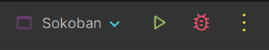

# Sokoban

A remake of the classic 1982 puzzle game [Sokoban](https://en.wikipedia.org/wiki/Sokoban) in
the [Gamekit](https://github.com/kwameopareasiedu/gamekit) game engine.

## Requirements

The game isn't available as an executable yet, so you'll have to clone the repo and run in your IDE.
You'll need to have the following installed and configured on your computer.

- Java 18 or higher
- Maven 3.9.9 or higher
- IntelliJ IDEA (Recommended)

## Running The Game

Follow these steps to run the game:

1. Clone the repo
2. Open the repo in your IDE
3. Open a terminal in the project root and run `mvn install` to download dependencies
4. Run the `Sokoban.main()` method via your IDE. If you use IntelliJ IDEA, this is the green play button in the menu
   bar.

## Contributors

- [Kwame Opare Asiedu](https://github.com/kwameopareasiedu)

